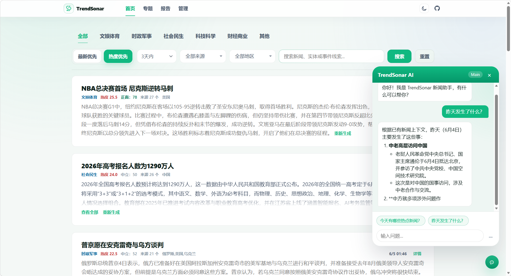
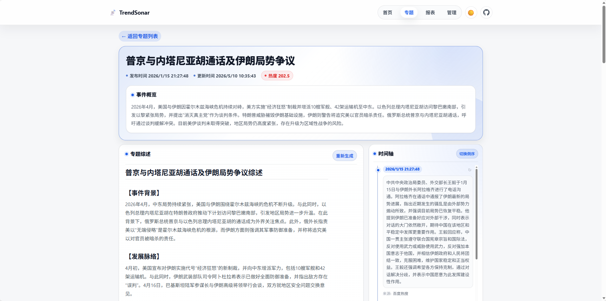
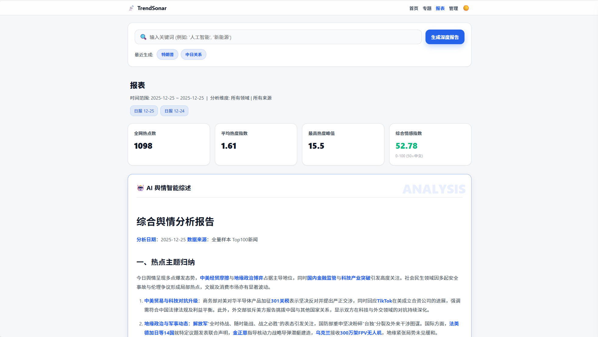
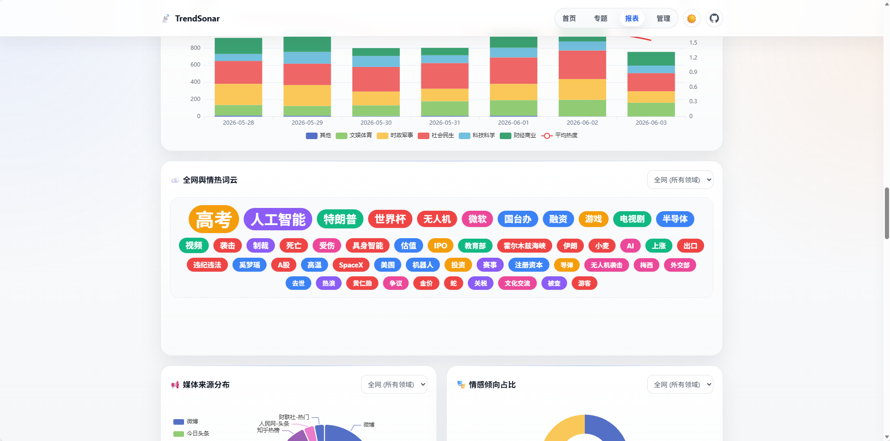

# TrendSonar

Current Version: **v0.2.8**

TrendSonar is a web tool designed for news aggregation, event deduplication, topic tracking, public opinion reporting, and news agent Q&A. It continuously fetches content from configured news sources, leveraging Embedding, OpenAI-compatible LLMs, Crawl4AI/Playwright for content fetching and structured analysis, to cluster, summarize, categorize, perform sentiment analysis, extract keywords/entities, organize topics, and generate reports.

The project is suitable for building personal or internal team news dashboards, such as tracking industry trends, monitoring public event progress, compiling keyword reports, generating daily hot news briefings, or using an agent to search the local news database via natural language. AI analysis results depend on source quality, model capabilities, prompts, and data accumulation time. It is recommended as an auxiliary reading and analysis tool; important conclusions should still be verified against the original sources.

## Online Demo

Try it out at:

Comprehensive News Aggregation: [https://ainews.izam.cn](https://ainews.izam.cn)

Pharma/Healthcare Vertical Industry News: [https://mednews.izam.cn](https://mednews.izam.cn)

## Feature Overview

### News Crawling & Processing

- Configure multiple news sources via `data/news_sources.json`, supporting enable/disable status, source weights, and URL management.
- Compatible with RSS/XML, JSON APIs, and some web-based hot news sources.
- Supports card-style addition, editing, deletion, and testing of news sources via the admin panel.
- Tracks news source health status, including latest crawl results, test results, failure counts, and error messages.
- Uses Crawl4AI/Playwright for full-text fetching, supporting dynamic page waiting, timeouts, retries, and concurrency control.
- Supports auxiliary crawl configs like Weibo cookies, ignored domains, and keyword filtering.

### Hot News List & Semantic Search

- Homepage displays news by heat or time, supporting pagination, time range, category, region, and source filtering.
- Supports `today`, `24h`, `3d`, `7d`, `30d`, `week`, `month`, `year`, `all`, and custom date ranges.
- Keyword search prioritizes vector retrieval, combined with text matching to improve search usability.
- News detail modals display summaries, sources, keywords, entities, sentiment, related reports, and similar news.
- Supports generating hot news images and agent news card images for sharing or archiving.

### AI Analysis & Clustering

- Automatically generates AI summaries for hot news, falling back to source summaries when full text is insufficient.
- Automatically completes categories, regions, sentiment, keywords, and entities.
- Uses Embedding similarity and AI verification to deduplicate and aggregate multi-source reports on the same event.
- Supports primary model, backup model, and AI routing by function, e.g., summary, sentiment, clustering, topics, reports, chat.
- Supports testing Embedding, primary model, and backup model connectivity in the admin panel.

### Topic Tracking

- Automatically discovers candidate event clusters from recent hot news and generates topics via AI review.
- Supports topic lists, topic details, timelines, related news, and topic trend dashboards.
- Supports manual creation, renaming, deletion of topics, and backend scanning to match related news.
- Supports refreshing topic overviews and refreshing individual timeline node summaries.
- Configurable parameters include topic retrieval pool size, candidate cluster count, AI review batch size, similarity threshold, quality grade, minimum news count, and minimum source count.

### Reports & Charts

- Supports comprehensive and keyword reports, filterable by time, category, region, source, and sample size.
- Provides source distribution, word clouds, sentiment distribution, positive/negative keywords, heat trends, related news, and term co-occurrence networks.
- Supports daily, weekly, and monthly report caching, as well as reading and deleting historical reports.
- AI reports support streaming output; in-depth keyword reports generate Markdown content around event evolution, opinion spectrum, risks/opportunities, and follow-up observations.

### News Agent

- Built on PydanticAI, supports continuous conversation and tool call event streaming.
- Can call built-in tools to query hot news, semantically search news, read news details, query topics, read topic details, fetch report data, create keyword reports, create event topics, analyze term trends, search the web, fetch web page content, and generate news images.
- Supports adding custom HTTP tools in the admin panel, configuring parameters, executors, prompt hints, and enable status.
- Custom tools support GET/POST, URL/Query/Header/Body templates, result path slicing, and response body compression.
- Basic URL security validation for web crawling and custom tools to prevent access to local, intranet, or high-risk metadata addresses.

### Admin Panel

- Admin URL: `/admin`.
- Supports login state cookies; admin password is set via `.env` or the `ADMIN_PASSWORD` environment variable.
- Allows online maintenance of runtime config, news sources, prompts, background tasks, logs, and agent tools.
- Supports viewing daily memory logs, historical log files, task status, and manually triggering crawl analysis and historical data backfilling.
- Modifying `config.yaml` triggers a service restart to reload the configuration.

## Tech Stack

- Web Framework: FastAPI, Starlette, Jinja2
- Database: SQLAlchemy Async, default SQLite, configurable PostgreSQL
- AI Integration: OpenAI-compatible API, `openai` SDK, `pydantic-ai`
- Vector Capabilities: Embedding API, default example uses SiliconFlow
- Crawling Capabilities: aiohttp, BeautifulSoup, Crawl4AI, Playwright
- Frontend Charts: ECharts
- Image Generation: Pillow
- Deployment: Docker / Docker Compose

## Project Structure

```text
TrendSonar/
├── app/
│   ├── api/              # FastAPI API routes
│   ├── core/             # Configuration, database, logging, prompt defaults
│   ├── models/           # SQLAlchemy data models
│   ├── services/         # Business services for crawling, clustering, reports, topics, agent, etc.
│   └── utils/            # General utilities for config I/O, search, images, web tools, etc.
├── data/                 # Runtime data, news sources, prompts, and tool configs
├── docker/               # Docker example configs
├── docs/images/          # README screenshots
├── static/               # Frontend static assets
├── templates/            # Page templates
├── main.py               # Application entry point
├── config.yaml           # Main configuration file
└── requirements.txt      # Python dependencies
```

## Quick Start (Docker Compose)

Docker Compose deployment is recommended. Prepare runtime config and news source files before starting.

### 1. Prepare Directories

```bash
mkdir -p data
```

Copy or refer to the example files in the repository:

- `docker/data/config.yaml` -> `data/config.yaml`
- `docker/data/news_sources.json` -> `data/news_sources.json`

At minimum, configure:

- `DATABASE_URL`: Database connection, default `sqlite+aiosqlite:///data/trendsonar.db`
- `SILICONFLOW_API_KEY` / `SILICONFLOW_BASE_URL` / `EMBEDDING_MODEL`: Embedding config
- `MAIN_AI_API_KEY` / `MAIN_AI_BASE_URL` / `MAIN_AI_MODEL`: Primary generation model
- `BACKUP_AI_API_KEY` / `BACKUP_AI_BASE_URL` / `BACKUP_AI_MODEL`: Backup generation model
- `ADMIN_PASSWORD`: Admin password, recommended to set via environment variable

### 2. Create `docker-compose.yml`

```yaml
version: '3.8'

services:
  trendsonar:
    image: instarsea/trendsonar
    container_name: trendsonar
    restart: always
    ports:
      - "8193:8193"
    volumes:
      - ./data/config.yaml:/app/config.yaml
      - ./data:/app/data
    environment:
      - TZ=Asia/Shanghai
      - ADMIN_PASSWORD=your_secure_password
```

### 3. Start Service

```bash
docker-compose up -d
```

After starting, visit:

- Homepage: `http://localhost:8193`
- Topics: `http://localhost:8193/topics`
- Reports: `http://localhost:8193/report`
- Admin Panel: `http://localhost:8193/admin`

## Docker CLI Deployment

```bash
docker run -d \
  --name trendsonar \
  -p 8193:8193 \
  -v /path/to/your/data/config.yaml:/app/config.yaml \
  -v /path/to/your/data:/app/data \
  -e TZ=Asia/Shanghai \
  -e ADMIN_PASSWORD=your_secure_password \
  instarsea/trendsonar
```

Replace `/path/to/your/data` with your actual data directory. On Windows, you can use formats like `D:/trendsonar/data:/app/data` for volume mounts.

## Local Source Code Run

Python 3.11 is recommended.

```bash
python -m venv .venv
.venv\Scripts\activate
pip install -r requirements.txt
python main.py
```

Linux / Debian environments can use:

```bash
python3 -m venv .venv
source .venv/bin/activate
pip install -r requirements.txt
python main.py
```

Full-text fetching relies on Playwright/Chromium. If browser dependencies are missing on first local run, execute:

```bash
python -m playwright install chromium
python -m playwright install-deps chromium
```

You can also specify the config file via command line:

```bash
python main.py --config /path/to/config.yaml
```

## Configuration Guide

Config loading priority: init parameters, `config.yaml`, environment variables, `.env`, file secrets. Default is `config.yaml` in the project root, or specify via `TRENDSONAR_CONFIG` env var or `--config` startup param.

Common config items:

| Config Item | Description |
| --- | --- |
| `APP_NAME` | Page title and system name |
| `PORT` | Service port, default `8193` |
| `LOG_LEVEL` / `LOG_RETENTION_DAYS` | Log level and log file retention days |
| `DATABASE_URL` | Database connection, supports SQLite and PostgreSQL |
| `WEIBO_COOKIE` | Cookie required for Weibo full-text fetching |
| `CRAWLER_CONCURRENCY` | Full-text fetch concurrency |
| `CRAWLER_*` | Full-text fetch wait, timeout, retry, and min length configs |
| `SILICONFLOW_*` / `EMBEDDING_MODEL` | Embedding service config |
| `MAIN_AI_*` | Primary generation model config |
| `BACKUP_AI_*` | Backup generation model config |
| `AI_ROUTE` | Use `main` or `backup` model for each functional module |
| `SCHEDULE_INTERVAL_MINUTES` | Auto full-process task interval |
| `AUTO_SUMMARY_TOP_N` | Number of news for auto summarization |
| `AUTO_ANALYSIS_TOP_N` | Number of news for auto deep analysis |
| `CLUSTERING_THRESHOLD` | News clustering similarity threshold |
| `FOLLOW_KEYWORDS` | Followed keywords, comma-separated; empty means no filtering |
| `FOLLOW_KEYWORDS_THRESHOLD` | Followed keywords vector similarity threshold |
| `NEWS_CATEGORIES` | News category list |
| `IGNORED_DOMAINS` | Ignored domain list |
| `DATA_CLEANUP_*` | Auto cleanup config for low-heat historical news |
| `TOPIC_*` | Topic generation, matching, update time window, and quality control |
| `TOPIC_DISCOVERY_*` | v0.2.8 topic candidate cluster discovery and AI batch review parameters |

`AI_ROUTE` example:

```yaml
AI_ROUTE:
  SUMMARY: "main"
  SENTIMENT: "backup"
  KEYWORDS: "backup"
  CLUSTERING: "backup"
  TOPIC_NAME: "backup"
  TOPIC_EVAL: "backup"
  TOPIC_MATCH: "backup"
  TOPIC_TIMELINE: "backup"
  TOPIC_OVERVIEW: "backup"
  TOPIC_INITIAL_SUMMARY: "main"
  REPORT: "backup"
  CHAT: "backup"
```

## News Source Configuration

News sources are located at `data/news_sources.json`, basic structure:

```json
[
  {
    "name": "Source Name",
    "weight": 1.0,
    "address": "https://example.com/rss-or-api",
    "enabled": true
  }
]
```

Field descriptions:

- `name`: Source name, displayed in lists and reports.
- `weight`: Source weight, affects heat calculation.
- `address`: RSS, XML, JSON, or parseable news API URL.
- `enabled`: Whether this source is active.

Admin panel news source tests do not write to the database, suitable for checking crawl results and full-text fetch quality before official saving.

## Common APIs

| Endpoint | Description |
| --- | --- |
| `GET /api/app_info` | App name and version |
| `GET /api/news` | News list, filtering, and semantic search |
| `GET /api/news/top` | Hot news TopN |
| `GET /api/news/{news_id}` | News details |
| `GET /api/news/{news_id}/similar` | Similar news |
| `POST /api/generate_summary/{news_id}` | Generate summary for a single news item |
| `GET /api/news_image` | Generate hot news image |
| `GET /api/topics/list` | Topic list |
| `GET /api/topics/{topic_id}` | Topic details |
| `GET /api/topics/{topic_id}/trends` | Topic trend data |
| `POST /api/report/generate` | Generate report |
| `GET /api/report/analysis` | Report analysis data |
| `GET /api/report/term-analysis` | Term analysis |
| `GET /api/chat` | RAG Q&A based on news database |
| `GET /api/agent/chat` | Agent tool call Q&A stream |
| `POST /api/trigger_crawl` | Admin manual trigger for full process |

Admin endpoints require login or admin authentication, including config read/write, source maintenance, log viewing, task status, AI connectivity tests, agent tool maintenance, etc.

## Auto Tasks

Upon startup, the app initializes the database and starts scheduled tasks. Default workflow includes:

1. Crawl all enabled news sources.
2. Save new news and update source health status.
3. Cluster and deduplicate recent window news.
4. Batch complete categories, regions, sentiment, keywords, and entities.
5. Generate AI summaries for hot news.
6. Generate or refresh daily report cache.
7. Refresh topics at configured intervals.
8. Clean up low-heat historical data per config.

Additionally, the scheduler generates final daily, weekly, and monthly report caches at specific times. After the full-process task completes, the service attempts to restart per current logic to free memory.

## Usage Recommendations

- Initial runs have small data volumes, so clustering, topics, and reports will be limited. Recommend running for a while before evaluating quality.
- News source quality directly impacts results. If a source fails frequently, check its health status in the admin panel and test it separately.
- Dynamic page full-text fetching consumes more memory. On low-spec machines, keep `CRAWLER_CONCURRENCY` at `1-2`.
- Clustering threshold too low may cause false merges, too high may miss merges; higher topic quality grades generate fewer topics but are more stable.
- Keyword reports and agent Q&A are based only on indexed news and callable tools, not representing the full internet.
- For high-risk judgments involving law, healthcare, investment, public safety, etc., always refer to original sources and authoritative information.

## Recommended News Sources

If you need to expand RSS or hot news sources, refer to:

- [Hot News](https://github.com/orz-ai/hot_news): Daily hot news aggregation.
- [NewsNow](https://github.com/ourongxing/newsnow): Multi-platform hot list aggregation, provides some RSS/API endpoints.
- [RSSHub](https://github.com/DIYgod/RSSHub): Generates RSS for many websites.
- [AnyFeeder](https://plink.anyfeeder.com/): RSS source aggregation service.

## UI Preview

### Hot News List



### Topic Tracking



### In-Depth Reports




## Changelog

- **v0.2.8**: Enhanced news agent capabilities, added web search, web content fetching, news image generation, and admin custom HTTP tools; optimized news source card management, health status display, AI connectivity testing, log viewing, topic candidate cluster discovery, and AI batch review parameters; strengthened report term analysis, topic trends, and news detail experience.
- **v0.2.7**: Optimized news details, similar news retrieval, report interaction, and admin config experience.
- **v0.2.6**: Refactored UI visual styles, optimized performance, prompts, and topic generation logic.
- **v0.2.5**: Optimized search and vector retrieval, added keyword trend analysis to topics module, added keyword analysis to reports page, optimized UI interaction and news detail modals.
- **v0.2.1**: Added reporting capabilities to topics module, including word clouds, source distribution, sentiment analysis, related news, and keyword trends.
- **v0.2.0**: Optimized token consumption, log display, and topic duplicate generation issues.
- **v0.1.7**: Optimized token consumption, aggregation workflow, and homepage filtering interaction.
- **v0.1.6**: Optimized keyword deep analysis interaction, supports custom prompts in admin panel.
- **v0.1.5**: Optimized topic generation logic, supports manual addition, editing, and deletion of topics.
- **v0.1.4**: Added topic quality review grade config, optimized topic generation logic.
- **v0.1.3**: Optimized memory usage and topic tracking review logic.
- **v0.1.2**: Optimized scheduled task workflow on config anomalies.
- **v0.1.1**: Fixed some authentication issues.
- **v0.1.0**: Initial release, published to Docker Hub.

## Star History

[](https://www.star-history.com/#aicezam/trendsonar&type=date&legend=top-left)

## License

This project is open-source under the [MIT License](LICENSE).
